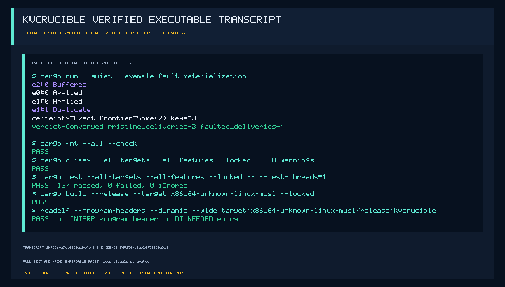
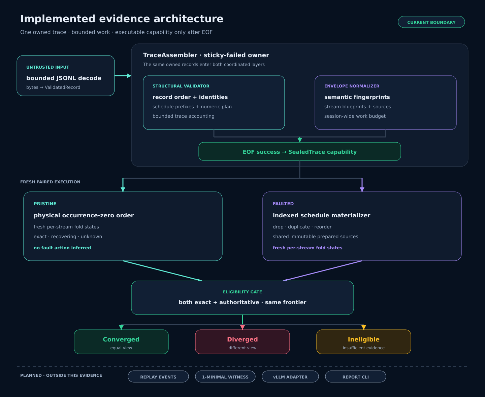
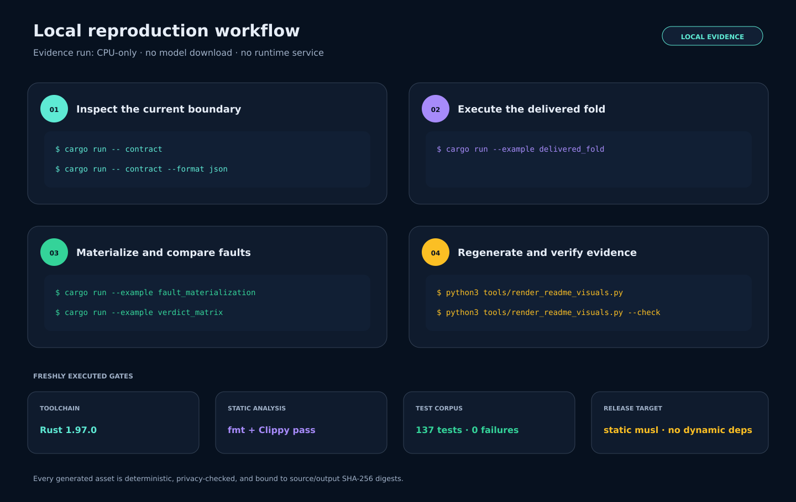
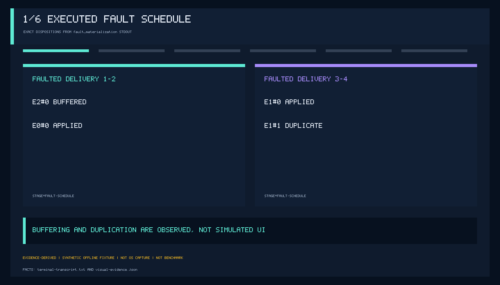
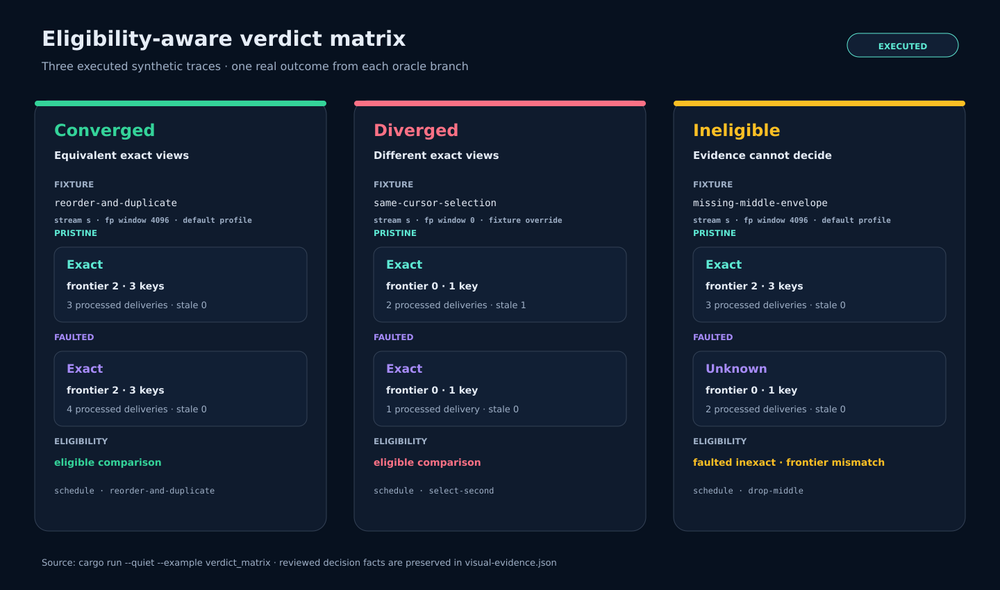
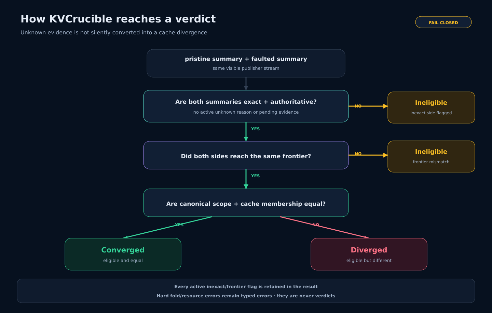

# KVCrucible

Offline conformance evidence for unreliable LLM KV-cache event streams.

KVCrucible answers a narrow but operationally important question: after a
consumer joins late, misses an event, sees a duplicate, or observes reordered
delivery, what can it still truthfully claim about its cache view?

It turns a bounded canonical trace into explicit `Exact`, `Recovering`, or
`Unknown` state, executes deterministic drop/duplicate/reorder schedules, and
compares fresh pristine and faulted folds without importing a serving engine or
inspecting GPU memory.

> **Current boundary:** bounded JSONL ingestion, structural validation,
> session-bound semantic fingerprints, tri-state cache folding, deterministic
> fault materialization, and an eligibility-aware `Converged` / `Diverged` /
> `Ineligible` oracle are implemented. Replay orchestration, witness reduction,
> stable report commands, and a production-engine adapter are not.

[](https://github.com/omar07ibrahim/kvcrucible/actions/workflows/ci.yml)
[](https://github.com/omar07ibrahim/kvcrucible/actions/workflows/readme-media.yml)


[](docs/visuals/media/terminal-transcript.png)

This deterministic evidence plate renders exact fault-example stdout and
explicitly labeled normalized quality-gate outcomes from the checked
[transcript](docs/visuals/generated/terminal-transcript.txt). It is
evidence-derived, not an OS screenshot or terminal capture, and makes no
benchmark claim. The same executable run produces
[machine-readable evidence](docs/visuals/generated/visual-evidence.json),
[a plain summary](docs/visuals/generated/evidence-summary.txt),
[an accessible vector transcript view](docs/visuals/generated/terminal-evidence.svg),
[a source manifest](docs/visuals/generated/manifest.sha256.json), and
[a raster media manifest](docs/visuals/media/manifest.sha256.json).
The transcript preserves exact contract/example stdout, records normalized gate
outcomes, and intentionally omits successful stderr.

## What the current evidence proves

The checked synthetic corpus exercises the implemented trust boundary:

- input is decoded and structurally validated under explicit finite limits;
- one `TraceAssembler` binds validation and normalization to the same owned
  records and becomes sticky-failed after any error;
- executable schedules become available only after structural EOF validation
  and normalization sealing both succeed;
- fault plans materialize stable drop, duplicate, and reorder occurrences while
  sharing immutable prepared sources;
- pristine and faulted executions start from fresh stream states; and
- incomplete evidence produces `Ineligible`, not a convenient false
  `Diverged`.

It does **not** prove a serving engine correct, inspect tensor contents, infer
allocator or reference-count state, benchmark routing, or claim compatibility
with vLLM or Dynamo.

[](docs/visuals/generated/architecture.svg)

The dashed layer at the bottom is deliberate: replay request/outcome records,
1-minimal witness reduction, the pinned engine adapter, and a report CLI remain
outside the implemented evidence.

## Reproduce it locally

The repository pins Rust 1.97.0, including `rustfmt`, Clippy, and the
`x86_64-unknown-linux-musl` target. The examples use synthetic traces and need
no GPU, model download, paid API, or running service.
Evidence generation additionally requires Linux/POSIX, Python 3.11 or newer,
and GNU `readelf` from binutils; the Python renderer uses only the standard
library.

[](docs/visuals/generated/setup-workflow.svg)

```bash
rustup show active-toolchain
cargo run -- contract
cargo run --example delivered_fold
cargo run --example fault_materialization
cargo run --example verdict_matrix
```

`contract --format json` separates current capabilities, remaining v0.1 work,
and non-goals for CI or downstream tooling:

```bash
cargo run -- contract --format json
```

Run the complete local quality and evidence gate:

```bash
cargo fmt --all --check
cargo clippy --all-targets --all-features --locked -- -D warnings
cargo test --all-targets --all-features --locked
cargo build --release --target x86_64-unknown-linux-musl --locked

python3 tools/render_readme_visuals.py
python3 tools/render_readme_visuals.py --check
python3 tools/render_readme_media.py check \
  --repository . --media-directory docs/visuals/media
python3 scripts/verify_readme_media.py \
  --repository . --directory docs/visuals/media
```

The generator executes the examples and quality gates before rebuilding the
assets. Fixed commands run with bounded time and output. Their environment is
allowlisted, but deliberately not hermetic: caller-provided `PATH`,
`CARGO_HOME`, and `RUSTUP_HOME` remain the trusted toolchain-discovery
boundary. Secure evidence-file handling is Linux/POSIX-only; it opens every
repository component with `dirfd` plus `O_NOFOLLOW`, requires regular
non-symlink files, bounds reads, and atomically replaces each generated file
through one pinned destination-directory descriptor. The bundle is
deliberately not transactional and is not rolled back: the manifest is
published last, so an interrupted bundle leaves an old or stale manifest that
the next `--check` rejects. The generator also rejects unexpected output files,
host-specific paths, common credential patterns, emails, and terminal escapes.
Its manifest binds a stable pre-capture snapshot of the relevant sources and
every non-manifest generated output by SHA-256. Source drift after capture or
during publication is rejected; the manifest remains the last published file.
The executable failure boundaries are covered by
`python3 -m unittest discover -s tests -p 'test_*.py' -v`.

## Watch a fault schedule execute

The fault demo validates and normalizes one trace, seals it, duplicates `e1`,
moves `e2` before `e0`, folds the resulting stable occurrences, and compares
that execution with the pristine physical order:

[](docs/visuals/media/verdict-fault-workflow.gif)

The evidence-derived animation plays once and carries the exact six reviewed
fact records in its frame comments. It is not a production capture and does not
report throughput or latency. The
[static fault timeline](docs/visuals/generated/fault-timeline.svg) and
[static verdict matrix](docs/visuals/generated/verdict-matrix.svg) remain
available as non-animated alternatives.

```bash
cargo run --example fault_materialization
```

```text
e2#0 Buffered
e0#0 Applied
e1#0 Applied
e1#1 Duplicate
certainty=Exact frontier=Some(2) keys=3
verdict=Converged pristine_deliveries=3 faulted_deliveries=4
```

`e2` is buffered until cursors `0` and `1` arrive. The extra `e1` occurrence is
classified as a duplicate. Both sides then finish exact at frontier `2` with
the same three-key view, so this schedule converges despite different transport
history.

## Exercise every oracle outcome

`verdict_matrix` executes three bounded synthetic traces and emits reviewed,
decision-relevant runtime facts as deterministic JSON:

```bash
cargo run --example verdict_matrix
```

[](docs/visuals/generated/verdict-matrix.svg)

- **Converged:** both sides are eligible and their canonical cache views match.
- **Diverged:** both sides are exact at the same frontier, but membership
  differs.
- **Ineligible:** one side is `Unknown` and the frontiers differ, so available
  evidence cannot justify a convergence claim.

The `Diverged` fixture deliberately overrides the retained fingerprint window
from its default `4096` to `0`. The pristine run therefore records its second
cursor-`0` payload as `stale_unverifiable=1`, not as a verified equivocation;
the faulted run drops the first payload and applies the second. Both views stay
exact at frontier `0` but contain different keys. The runtime window and stale
diagnostics are present in the JSON and the generated matrix.

The fixtures are synthetic by design. They test KVCrucible's model and fault
executor; they are not presented as captures from a production engine.

## Exact, recovering, and unknown are different

A cache-event consumer can retain useful partial state without having enough
evidence to call that state complete:

- **Exact** follows a trusted baseline or clear anchor with no unresolved gap,
  conflict, or unavailable evidence.
- **Recovering** retains a bounded clean gap and waits for missing delivery.
- **Unknown** means missing or conflicting history prevents an authoritative
  complete view.

[](docs/visuals/generated/certainty-decision.svg)

Hard fold failures stay typed errors; they are never converted into verdicts.
An eligible comparison requires exact authoritative summaries at the same
frontier. Only then can equal membership mean `Converged` or unequal membership
mean `Diverged`.

## Why the internal split matters

Transport envelopes and cache mutations are separate layers. A cursor gap is a
fact about delivered history, not proof that the engine mutated cache state
incorrectly.

The current core enforces several less-visible invariants:

- sequence and epoch are scoped to one publisher stream, never globally;
- cache hashes remain opaque and preserve their wire type;
- semantic fingerprints exclude transport-only fields but remain ordered and
  session-bound;
- fault schedules snapshot the source and stream prefixes visible where the
  schedule record appears;
- duplicate occurrences share prepared source payloads rather than copying or
  re-fingerprinting them;
- cache-view updates are atomic under resource failure; and
- the indexed materializer is property-tested against a slower vector reference
  model.

The wire-independent data model is specified in
[IR v1](spec/ir-v1.md), while [semantics](spec/semantics.md) defines the
publisher-local cursor, baseline, gap, clear-barrier, and verdict rules.

## Implemented versus planned

| Capability | Status | Evidence surface |
|---|---|---|
| Canonical bounded JSONL codec | implemented | golden/adversarial tests |
| Incremental structural validator | implemented | typed errors and exact limit tests |
| Session-bound semantic fingerprints | implemented | deterministic digest vectors |
| `Exact` / `Recovering` / `Unknown` fold | implemented | `delivered_fold` and state corpus |
| Drop/duplicate/reorder materializer | implemented | `fault_materialization` and property model |
| Eligibility-aware convergence oracle | implemented | `verdict_matrix` |
| Explicit replay request/outcome/expiry model | planned | not represented by `origin: replay` |
| Deterministic 1-minimal witness reducer | planned | no witness claim yet |
| Stable report/analyze CLI | planned | current CLI exposes `contract` only |
| Version-pinned production adapter | planned | compatibility matrix lists none |

The detailed product boundary lives in the
[project charter](docs/charter.md), and supported integrations will appear only
in the [compatibility matrix](docs/compatibility.md).

## Threat boundary

- Inputs are untrusted and resource-bounded before semantic processing.
- Raw token IDs are omitted or keyed-digested by default. An unkeyed digest is
  described as linkable pseudonymization, not confidentiality.
- Unknown core fields fail closed.
- The core has no network listener, dynamic plugin loading, engine import, or
  automatic production repair path.
- Evidence errors do not echo trace-controlled identities or token material.

See [the threat model](docs/threat-model.md) for attacker capabilities,
resource ceilings, privacy assumptions, and deliberate non-goals.

## Motivation and upstream context

KVCrucible models documented cache-event behavior rather than treating events
as a generic message queue:

- [vLLM KV-event subscriber example](https://docs.vllm.ai/en/stable/examples/features/kv_events/)
- [vLLM KV-event configuration](https://docs.vllm.ai/en/v0.23.0/api/vllm/config/kv_events/)
- [NVIDIA Dynamo router design](https://docs.nvidia.com/dynamo/dev/knowledge-base/modular-components/router/router-design)
- [Dynamo replay comparison](https://docs.nvidia.com/dynamo/v1.0.2/components/router/kv-event-replay-dynamo-vs-v-llm)

These references motivate the model. They do not imply endorsement,
compatibility, or formal verification.

## License

Apache-2.0. See [LICENSE](LICENSE).
